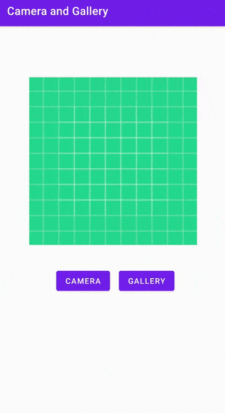

# android-camera-gallery
Learn How to Open Camera in our android app and capture image and display the full size image in image view, we will Also learn how to save the image into gallery. Using Android Studio.

## 教學
此範例code為以下兩篇文章的完整版:
- [[Android] 內建相機拍照實作(1)](https://andy6804tw.github.io/2021/03/08/take-photos/)
- [[Android] 內建相機拍照實作(2)](https://andy6804tw.github.io/2021/03/12/android-take-photo-sand-save-gallery/)

除此之外這份程式碼與 [android-take-photo-sand-save-gallery](https://github.com/1010code/android-take-photo-sand-save-gallery) 的不同之處在於增加了按鈕選擇相簿中的照片並顯示在 ImageView 上。

## Reference
[Capture Image & Display in ImageView | Android App Development Tutorials](https://www.youtube.com/watch?v=s1aOlr3vbbk&list=PLlGT4GXi8_8eopz0Gjkh40GG6O5KhL1V1&index=1)